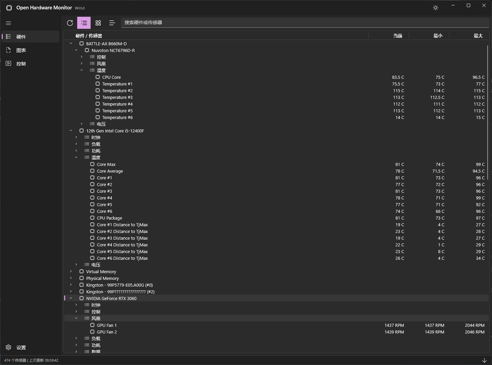
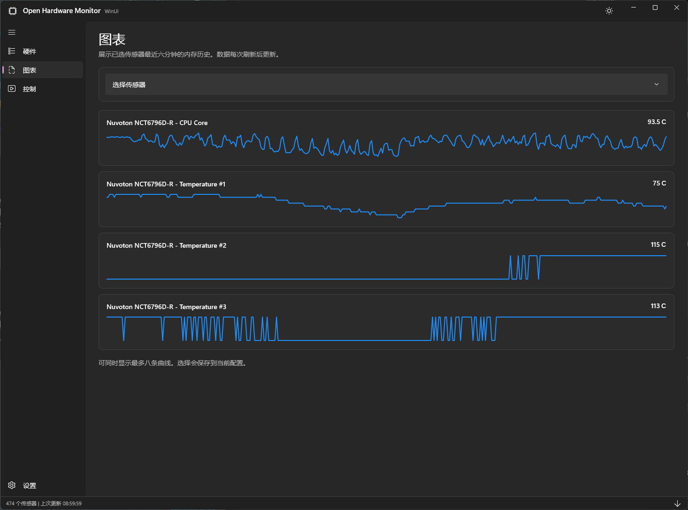
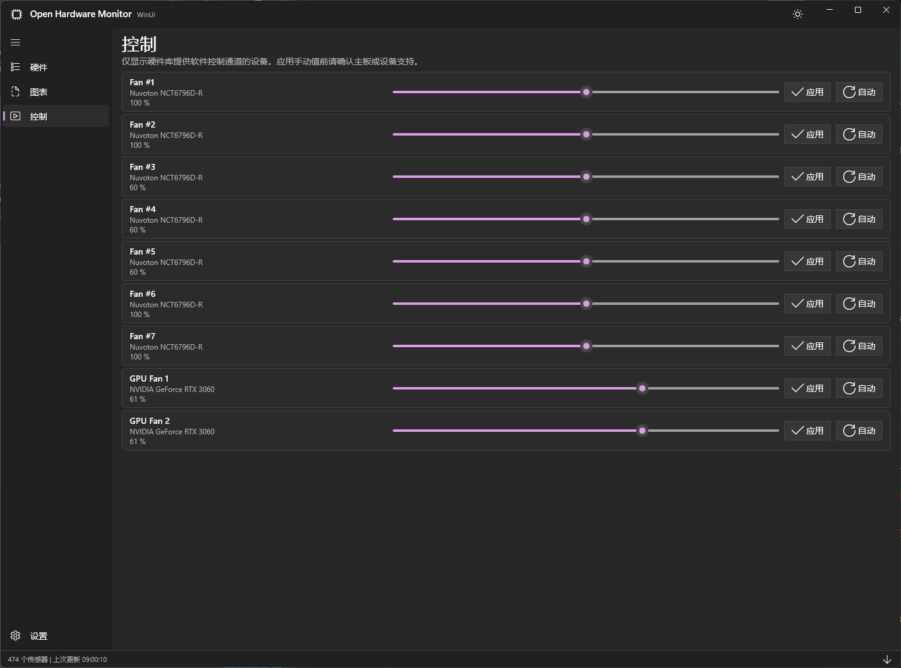

<p align="center">
  
</p>

# 🖥️ Open Hardware Monitor WinUI

> **[📖 English](README.en-us.md)**
> **[📖 简体中文（中国大陆）](README.md)**

[](https://github.com/VincentZyuApps/OpenHardwareMonitorWinUI/actions/workflows/release.yml) [](https://github.com/VincentZyuApps/OpenHardwareMonitorWinUI/releases/latest) [](https://github.com/VincentZyuApps/OpenHardwareMonitorWinUI/releases)  

Open Hardware Monitor WinUI 是一个面向 Windows 的实验性独立 WinUI 3 桌面应用，以紧凑的 Fluent 界面展示温度、风扇转速、电压、负载、频率等硬件传感器数据。

它复用[当前上游项目](https://github.com/HardwareMonitor/openhardwaremonitor)的 `OpenHardwareMonitorLib` 硬件采集层，但完全重写了 UI 与配置系统；它不会读取、导入或迁移旧 WinForms 应用的 XML 配置。

> [!WARNING]
> 当前版本仍处于不稳定测试阶段，界面布局、程序行为与设备支持仍可能变化。请在自己的硬件上核对传感器读数，并谨慎使用硬件控制功能。

## ✨ 功能亮点

### 🧭 硬件监控

熟悉的“硬件 → 传感器类型 → 传感器”层级被保留，并以更紧凑的 WinUI 3 交互重新实现。



- 逐层或全部展开与折叠，展开状态会保存到独立配置。
- 支持刷新、搜索、显示隐藏传感器，以及可拖动调宽的当前值、最小值和最大值列。
- 传感器菜单支持重命名、隐藏、加入图表、重置最小值/最大值和编辑参数。
- 双击硬件可打开独立 Fluent 信息窗口；同一设备只复用一个窗口，并可复制完整报告。

### 📈 图表

从包含传感器、硬件、类型和当前值的清晰列表中选择曲线，快速查看最近的变化趋势。



- 每个有读数的传感器在内存中最多保留最近 360 个采样点，关闭应用后不持久化。
- 最多同时显示八条曲线；选择结果会保存到当前 WinUI 配置。

### 🎛️ 风扇与硬件控制

控制页只显示底层硬件库实际提供的受支持控制通道，可设置软件控制值或恢复设备默认模式。



> [!CAUTION]
> 并非所有风扇或设备都支持软件控制。错误的手动值可能影响温度、稳定性或硬件寿命，请仅使用已确认安全的范围。

### 🪟 桌面体验与扩展

- 提供跟随系统、浅色和深色三种主题，主窗口与硬件信息窗口保持同步。
- 支持通知区域、关闭到托盘、启动时最小化，以及始终置顶的紧凑硬件状态悬浮窗。
- 可按日记录 CSV 传感器数据，并配置记录间隔。
- 可选的本地 Web / JSON API 默认监听 `127.0.0.1:8085`。

## ✅ 系统要求

| 项目 | 要求 |
| --- | --- |
| 操作系统 | Windows 10 版本 2004（build 19041）或更高版本，包括 Windows 11 |
| 架构 | x64 |
| 权限 | 应用会请求管理员权限，以访问低层硬件与驱动 |
| 运行时 | Release ZIP 为自包含包，无需单独安装 .NET 运行时 |

具体传感器与控制能力取决于主板、设备、驱动和 `OpenHardwareMonitorLib` 的支持情况。

## ⬇️ 下载与运行

1. 打开 [Releases](https://github.com/VincentZyuApps/OpenHardwareMonitorWinUI/releases/latest)。
2. 下载最新的 `OpenHardwareMonitor-*-win-x64.zip`；需要时同时下载对应的 `.sha256` 文件。
3. 将 ZIP 完整解压到可写目录，不要直接在压缩包内运行。
4. 启动 `OpenHardwareMonitorWinUI.exe` 并接受 UAC 提权提示。

可以在 PowerShell 中核对下载包的 SHA-256：

```powershell
Get-FileHash .\OpenHardwareMonitor-*-win-x64.zip -Algorithm SHA256
```

## ⚙️ 配置与便携模式

WinUI 应用使用全新的 JSON 配置，与旧 WinForms 配置完全独立。

| 内容 | 默认位置 |
| --- | --- |
| 用户配置 | `%LOCALAPPDATA%\OpenHardwareMonitorWinUI\OpenHardwareMonitor.WinUI.json` |
| 便携配置 | `OpenHardwareMonitorWinUI.exe` 所在目录下的 `OpenHardwareMonitor.WinUI.json` |
| CSV 日志 | `%LOCALAPPDATA%\OpenHardwareMonitorWinUI\Logs` |

在首次启动前，将空白 `.portable` 文件放到可执行文件旁，或使用 `--portable` 参数，即可启用便携配置；此操作不会自动迁移已有配置。

## 🛠️ 从源码构建

准备 Windows x64、Git 与 [.NET 10 SDK](https://dotnet.microsoft.com/download/dotnet/10.0)，然后运行：

```powershell
git clone https://github.com/VincentZyuApps/OpenHardwareMonitorWinUI.git
cd OpenHardwareMonitorWinUI
dotnet build OpenHardwareMonitor.App/OpenHardwareMonitor.App.csproj -c Debug
dotnet test OpenHardwareMonitor.App.Tests/OpenHardwareMonitor.App.Tests.csproj -c Debug
```

## 🗂️ 项目结构

| 项目 | 职责 |
| --- | --- |
| `OpenHardwareMonitorLib` | 上游硬件发现、传感器读取与设备控制 |
| `OpenHardwareMonitor.Core` | WinUI 应用的快照、配置、日志与 Web 服务 |
| `OpenHardwareMonitor.App` | Windows App SDK / WinUI 3 桌面界面 |
| `OpenHardwareMonitor.App.Tests` | WinUI 配置持久化与迁移测试 |

## 🚀 CI 与发布

- 提交信息包含 `[build-action]` 时，工作流会构建自包含 x64 ZIP 和 SHA-256，并上传 Actions artifact。
- `master` 分支上的 `[build-release]` 还会创建版本标签与 GitHub Release。
- 权威构建流程位于 [`.github/workflows/release.yml`](.github/workflows/release.yml)。

## 🔗 上游与许可

本项目是独立的实验性 WinUI 应用，并非上游的官方 UI 替代品；硬件采集层复用自 [HardwareMonitor/OpenHardwareMonitor](https://github.com/HardwareMonitor/openhardwaremonitor)，该项目源自[原始 OpenHardwareMonitor](https://github.com/openhardwaremonitor/openhardwaremonitor)。

`OpenHardwareMonitorLib` 项目声明使用 `MPL-2.0`；第三方组件保留各自的许可与版权声明。仓库目前没有覆盖整个新应用的根级许可证，分发修改版本前应先明确并补充项目许可证。
